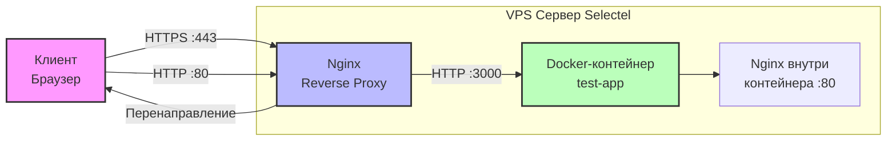

## Краткое описание

Сервер работает по схеме: весь внешний HTTP/HTTPS-трафик принимает Nginx, установленный на хосте. Он расшифровывает HTTPS-трафик (используя сертификаты Let's Encrypt) и передаёт запросы по HTTP в Docker-контейнер с Nginx. Доступ к контейнеру возможен только через localhost на порту 3000, что изолирует его от прямого внешнего доступа.

## Схема трафика

## Компоненты и порты

| Компонент | Порт | Назначение |
|-----------|------|------------|
| Nginx (хост) | 80 | Принимает HTTP-запросы, перенаправляет на HTTPS |
| Nginx (хост) | 443 | Принимает HTTPS-запросы, расшифровывает SSL |
| Nginx (хост) | — | Проксирует запросы в Docker-контейнер (localhost:3000) |
| Docker-контейнер (test-app) | 3000 | Точка входа на хост, принимает запросы от Nginx |
| Docker-контейнер (test-app) | 80 (внутренний) | Nginx внутри контейнера обрабатывает запрос |
| Node Exporter | 9100 | Отдаёт метрики (CPU, RAM, диск, сеть) |
| SSH | 22 | Доступ к серверу (только по ключам) |

## Потоки данных

### 1. HTTP-запрос (порт 80)

1. Клиент отправляет запрос на `http://serv123.ru`
2. Nginx на хосте получает запрос на порту 80
3. Nginx возвращает HTTP-статус 301 (перенаправление)
4. Браузер клиента автоматически переходит на `https://serv123.ru`

### 2. HTTPS-запрос (порт 443)

1. Клиент отправляет запрос на `https://serv123.ru`
2. Nginx на хосте принимает запрос на порту 443
3. Nginx расшифровывает HTTPS (SSL-сертификаты Let's Encrypt)
4. Nginx перенаправляет (проксирует) запрос по HTTP на `localhost:3000`
5. Docker-контейнер test-app принимает запрос на порту 3000
6. Внутри контейнера Nginx на порту 80 обрабатывает запрос
7. Ответ возвращается клиенту по тому же пути

### 3. Мониторинг

1. Node Exporter на хосте собирает метрики (CPU, RAM, диск, сеть)
2. Метрики доступны по HTTP на порту 9100: `http://serv123.ru:9100/metrics`
3. (В production порт был бы закрыт для внешнего доступа)

## Безопасность

| Что защищено | Как настроено |
|--------------|---------------|
| SSH | Root login запрещён. Парольная аутентификация отключена. Вход только по SSH-ключам |
| Firewall | UFW разрешает только порты: 22 (SSH), 80 (HTTP), 443 (HTTPS), 9100 (Node Exporter) |
| Fail2ban | Следит за `/var/log/auth.log`. После 3 неудачных попыток → блокировка IP на 1 час |
| Docker-контейнер | Порт 3000 открыт только на localhost (не торчит наружу) |
| SSL | Сертификаты Let's Encrypt с автоматическим обновлением |
| HTTP | Все запросы на порт 80 перенаправляются на HTTPS |
